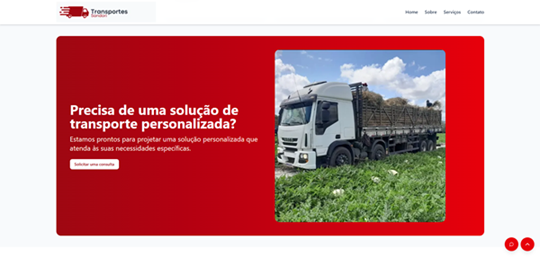

# Projeto acadêmico - Sandori Transportes

Criação de uma aplicação web front-end para divulgação de serviços de uma empresa. 
## Introdução

Com o objetivo de colocar em prática o aprendizado obtido durante o curso de Análise e Desenvolvimento de Sistemas, foi realizado o desenvolvimento de aplicação front-end com TypeScript e NextJS.

## O Projeto
Os requisitos solicitados era que o site fosse uma apresentação da empresa e de seus principais serviços, além de formas de entrar em contato. 

Para atendimento dos requisitos foram desenvolvidos os componentes: footer, navbar, seção de contato, seção principal/Home, seção de serviços e seção sobre. 

Além disso, foi criado um formulário onde o cliente pode entrar em contato para solicitar orçamento e um chatbot que consegue simular o valor de frete e encaminhar para o Whatsapp. 

O projeto pode ser acessado em: https://next-extensao-projeto.vercel.app/#home

## Tecnologias utilizadas

## Resultados 
- Seção Principal/Home (com navbar)
  

- Seção Sobre

- Seção Serviços

- Seção Contato

- Footer

